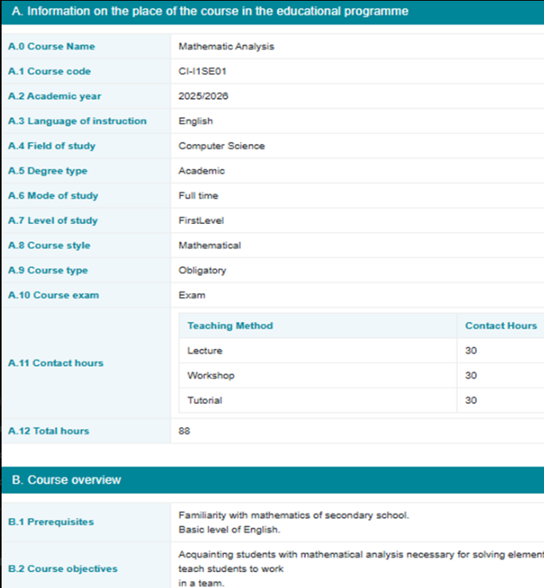
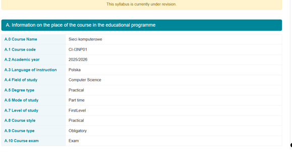
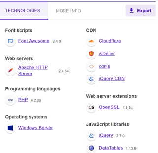

# Syllabus Management System

A role-based web application developed to reduce excessive paper usage in university syllabus management processes.
The system provides a centralized, secure, and well-structured platform for managing, reviewing, and publishing course syllabi, while also aiming to enhance database security and enable full control through a single platform.

---

## 📌 Project Overview

This project was developed for **Vistula University** to digitize syllabus management and minimize paper waste.  
Access is restricted to users with a **Vistula University email address**.

The system ensures that each user can only access features and content related to their assigned role.

---

## 🧑‍💼 User Roles

- **Student**
  - Can view **only approved syllabi**
- **Teacher**
  - Can create and edit syllabi for **their own courses**
- **Admin**
  - Reviews and approves syllabi before publication
- **Technical Staff**
  - Manages system security, backups, and data transfers

---

## 🔐 Access Control

- Login is restricted to **Vistula University email addresses**
- Role-based authorization
- Secure URLs using token-based validation

---

## 🖥️ System Interfaces

### Login Screen

### Course Syllabus Details

###  Under Revision Course Syllabus Details

### Syllabus Management Process Diagram

### Technologies & Tools

---

## 🔄 Syllabus Workflow

1. Teacher logs in
2. Teacher edits syllabus for own course
3. Admin reviews submitted syllabus
4. If incomplete → returned to teacher
5. If approved → shared with students

---

## 🧩 Key Features

- Role-based access control
- Syllabus creation and editing
- Admin review & approval workflow
- Approved syllabi visible to students
- Centralized control panel
- Backup and data import/export functionality
- Secure error handling with JSON
- Error logging system

---

## 📄 Approved Syllabus Content Includes

- Course requirements
- Course materials
- Grading rules
- Contact hours
- Teaching methods
- Academic year and course metadata
- All official syllabus information

---

## 🛠️ Technologies Used

### Backend
- PHP
- MySQL

### Frontend
- HTML
- CSS
- JavaScript
- Bootstrap
- Tailwind CSS

### Libraries & Tools
- PHPMailer (email notifications)
- DataTables (table management)
- JSON (error handling)
- Token-based URL security

---

## 🎯 Purpose

- Reduce paper waste in syllabus management
- Improve accessibility to course syllabi
- Ensure data consistency and integrity
- Provide centralized control through a single platform
- Enhance system security and clear role-based access separation

---

